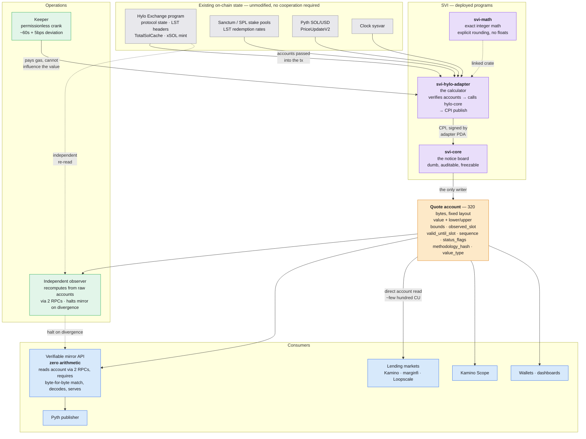
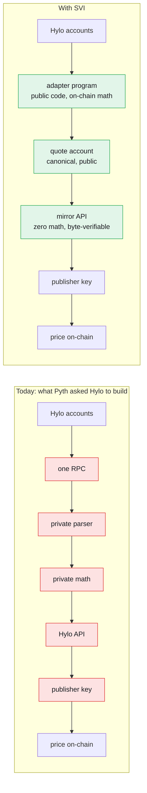
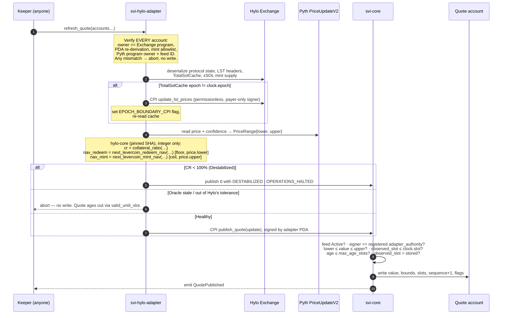
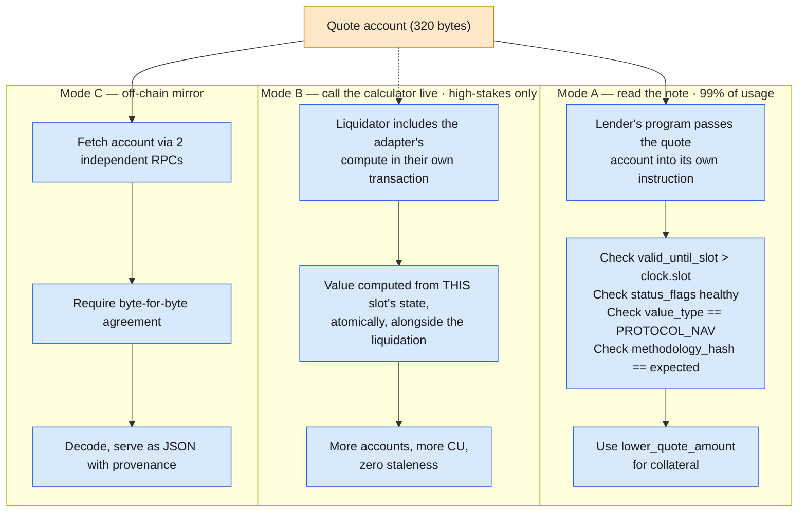
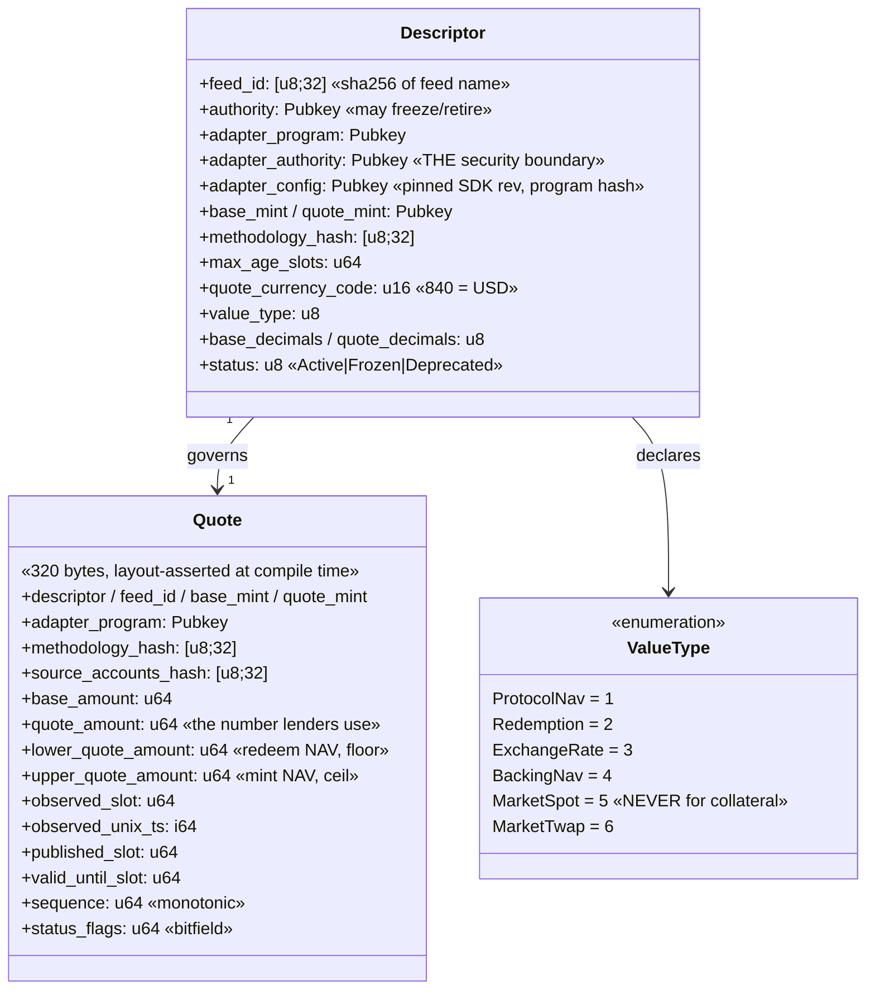
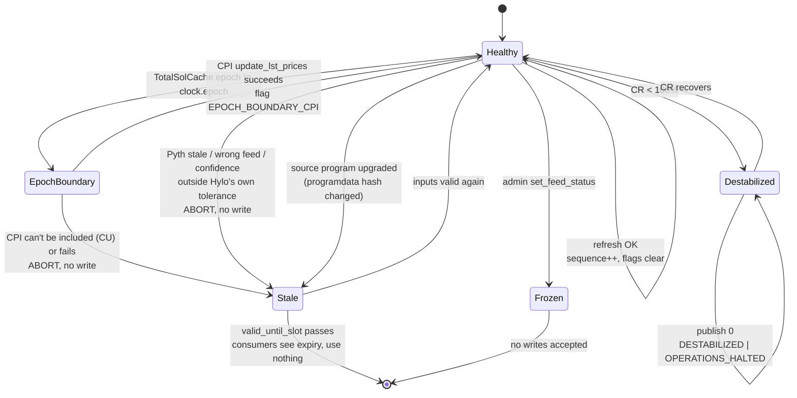
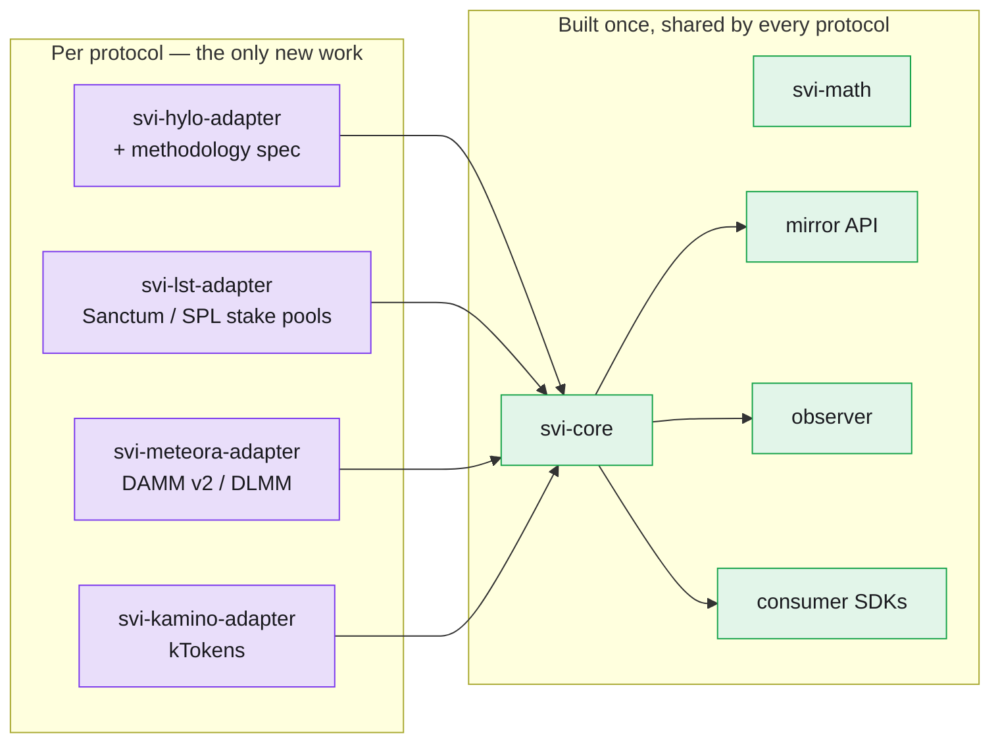

# SVI — Product Architecture

**Solana Valuation Interface** · v1 architecture · September 2026

> **One sentence:** the value of a protocol asset is computed by a program
> *on-chain*, from accounts anyone can verify, and written to a public account
> anyone can read — so no off-chain service ever has to be trusted with the
> arithmetic.

---

## 1. System context

Gray = already exists, SVI touches nothing. Purple = SVI builds and deploys.
Amber = the product. Blue = consumers.

### The five pieces, in plain language

| Piece | Analogy | Job |
|---|---|---|
| **Adapter** (`svi-hylo-adapter`) | the robot accountant | One per protocol. Knows *this* protocol's formula and account layout. Verifies every input account (owner, PDA derivation, mint, program ID), computes the value, refuses to work with unverified receipts. |
| **Core** (`svi-core`) | the rule that only the accountant may post to the wall | Tiny, protocol-agnostic, deliberately dumb. Knows nothing about Hylo. Enforces: registered adapter PDA signed it, sequence increases, observation is fresh and newer than what's stored, bounds are coherent. Dumb is auditable — and one day freezable. |
| **Quote account** | the audited statement posted on the wall | **This is the product.** 320 fixed bytes: the value, its bounds, when it was observed, when it expires, and a hash of exactly which formula produced it. |
| **Keeper** | the person who rings the bell | Sends the refresh transaction. Permissionless — anyone can crank. Pays gas; **cannot influence the number**. |
| **Observer** | the independent second accountant | Re-derives the value from raw accounts through separate RPCs and compares. Any divergence → alert + mirror halt. |

**The principle the whole design reduces to:** there is no point in the
pipeline where a human or a hackable server *chooses* the number. The number is
a pure function of on-chain state, computed by public code; everything
downstream only transports it.

---

## 2. Trust boundaries — before and after

Six trusted hops become one — and that one (the adapter) is public code whose
output any third party can reproduce byte-for-byte from the same slot's
account data.

**What SVI does not fix:** Pyth's publisher key management (hop `a5`) is
still Pyth's. SVI removes *hidden pricing logic*, not *all* infrastructure
risk. Claiming otherwise would be dishonest and Plish would catch it.

---

## 3. How a value gets refreshed

One transaction, all reads same-slot-consistent by construction.

**The security property in one line:** *anyone* can send this transaction, but
*nobody* can influence what value it writes. The keeper pays gas. The value is
computed by adapter code from verified accounts, and only the adapter's PDA can
authorize the write to core. If the keeper dies, anyone else's bot cranks it.
If nobody cranks it, the quote goes stale and `valid_until_slot` makes that
visible — it fails loud, it never lies.

---

## 4. How a value gets consumed

The mirror API is a **photocopier**. It cannot lie about the price, because
anyone can compare its output against the account it copied. That is what turns
Pyth's "give us an API" request into something safe to say yes to — Pyth gets
exactly the API it asked for, and the API does no math.

**Compute budget note:** an xSOL NAV computation touching multiple LST headers
plus a Pyth read costs tens of thousands of CU. Fine in a dedicated keeper
transaction; often *not* fine inside a consumer's liquidation transaction.
Design for Mode A as the default read path — that is why the stored quote
account, not the atomic preview, is the product.

---

## 5. Data model

Two decisions worth defending:

**Why `base_amount → quote_amount` instead of a decimal price?** A price like
"28.43125" forces every consumer to agree on a decimal convention and invites
float parsing. `1_000_000_000 base units = 28_431_250 quote units` is exact,
integer, and self-describing alongside `base_decimals` / `quote_decimals`.

**Why is `value_type` an on-chain enum rather than documentation?** So a
consumer that asked for NAV can never silently receive a market price. It is
validated in `initialize_feed` and it is the difference between the Moonwell
incident happening to an SVI consumer and not.

---

## 6. Failure states — *fail stale, never fail wrong*

The design rule: **no code path may publish a value computed from unvalidated
inputs.** Degraded is always preferable to plausible-but-wrong.

| Condition | Behaviour | Consumer sees |
|---|---|---|
| Everything healthy | publish, `sequence++` | fresh quote, flags clear |
| New epoch, LST crank not run | bundle Hylo's permissionless `update_lst_prices` CPI, then publish | `EPOCH_BOUNDARY_CPI` set |
| …and the CPI won't fit / fails | **abort, no write** | quote ages past `valid_until_slot` |
| CR < 100% (Destabilized) | publish **0**, halt flags, refresh hyUSD backing feed | `DESTABILIZED \| OPERATIONS_HALTED` — collateral value **zero**, not a dip to buy |
| Pyth stale / wrong feed / confidence outside Hylo's `OracleConfig` | **abort, no write** | stale quote, expiry visible |
| xSOL supply == 0 | NAV = exactly 1.000000000 both bounds | `ZERO_SUPPLY_DEFAULT` |
| Target program upgraded (layout drift) | **abort, no write** until reviewed | stale quote, expiry visible |
| Observer disagrees with chain | alert + **mirror API halts** | mirror stops serving; account still readable |

SVI imposes **no separate oracle tolerance** — it reads Hylo's own on-chain
`OracleConfig` fresh on every refresh. By design: the feed reflects what the
protocol itself would accept for a real redemption. SVI is not entitled to a
second opinion about Hylo's risk parameters.

---

## 7. Adding a protocol — why this generalises

Supporting a new protocol means: write one adapter that knows that protocol's
account layout, register its PDA as the authority for those feeds, point a
keeper at it, publish a methodology spec. **The target protocol never hears
from us.** Core, quote format, mirror, observer and SDKs are all shared.

---

## 8. Feed set — Hylo

Never one ambiguous feed called `xSOL/USD`. Value semantics are explicit,
per-feed, on-chain.

| Feed ID | Value type | Formula source | Status |
|---|---|---|---|
| `hylo-xsol-nav-v1` | `PROTOCOL_NAV` | `next_levercoin_redeem_nav` / `_mint_nav` | **spec drafted v0.9** |
| `hylo-hyusd-backing-v1` | `BACKING_NAV` | master equation Σ(vUSDᵢ); `depeg_stablecoin_nav` when CR < 100% | companion |
| `hylo-ehyusd-rate-v1` | `EXCHANGE_RATE` | `earn_pool_math` (hyUSD in pool / sHYUSD supply; zero → $1) | companion |
| `hylo-xsol-leverage-v1` | informational | TVL / (NAV × supply) | not a price |
| `hylo-xsol-redemption-v1` | `REDEMPTION` | redeem NAV **after protocol fees** | v1.1 |
| `hylo-hyusd-usdc-redemption-v1` | `REDEMPTION` | including applicable fee | v1.1 |

**V2 scaling:** the xAsset Engine turns this from a fixed list into
`4 feeds × N xAssets`. Each new xAsset is a methodology document and a config
entry, not a new API.

---

## 9. Build status

| Component | State | Notes |
|---|---|---|
| `crates/svi-math` | **Done** | Exact `u128`-intermediate integer math, mandatory explicit rounding, `no_std`, `#![deny(clippy::arithmetic_side_effects)]`, property tests |
| `programs/svi-core` | **Done** | Descriptor + 320-byte zero-copy Quote with compile-time layout assertion, `publish_quote` with the 4 rules, events, admin freeze |
| `docs/hylo-xsol-nav-v1-spec.md` | **Draft v0.9** | Pending Hylo answers to §10; 5 open questions |
| `programs/svi-hylo-adapter` | **Scaffolded** | Anchor skeleton in place; real instruction blocked on the §10 answers |
| `programs/svi-mock-adapter` | **Done** | Exercises the core's CPI + authority path end-to-end |
| Keeper | Not started | Phase 2 |
| Mirror API + observer | Not started | Phase 2 |

The critical-path dependency is not engineering capacity. It is **five
answers from Hylo** (spec §10) — which is the entire ask.

---

## 10. Design decisions and their rationale

| Decision | Why |
|---|---|
| Adapter reads accounts directly; no CPI to read | Solana has no view functions, and none are needed — account bytes are public and same-slot consistent within a transaction. Removes all publisher-side cooperation. |
| CPI only to *accrue* (`update_lst_prices`) | Some state is stale until cranked. Hylo's crank is permissionless (payer-only signer), so this needs no permission either. |
| Depend on `hylo-core`, reimplement nothing | Eliminates the single largest correctness risk — divergence between SVI's math and the protocol's own. Pin to an exact git SHA recorded on-chain in `adapter_config`. |
| `quote_amount = nav_redeem` (the conservative side) | Hylo prices NAV as a range and always takes the side favourable to the protocol. A holder liquidating xSOL realises the *redeem* side; therefore redeem NAV is the defensible collateral value. Publishing the full range preserves information for other consumers. |
| Rounding direction is a mandatory parameter, never a default | Round *against* whoever benefits: collateral down, debt up. A classic exploit family lives in the other choice. |
| Integer only, `u128` intermediates, `Option` returns | No floats anywhere. Every operation is total — no panics in the valuation path. |
| Core is deliberately dumb | Auditable, and eventually freezable. All protocol knowledge lives in swappable adapters. |
| `observed_slot` separate from `published_slot` | A consumer must be able to distinguish "when was this true" from "when was this written". |
| `methodology_hash` on every quote | Changing §§2–6 of a methodology produces a new hash and new feed — a consumer's expectations cannot silently change under it. |
| Store target program's deployed hash in `adapter_config` | Layout drift becomes a loud abort instead of a silent misprice. |
| No token, no operator network, no slashing | Duplicates the strongest part of Pyth/Switchboard while multiplying complexity and regulatory surface. |
